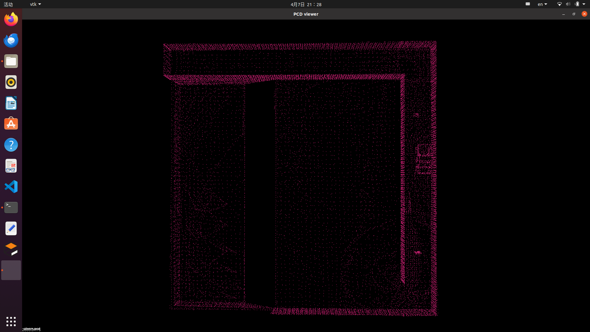
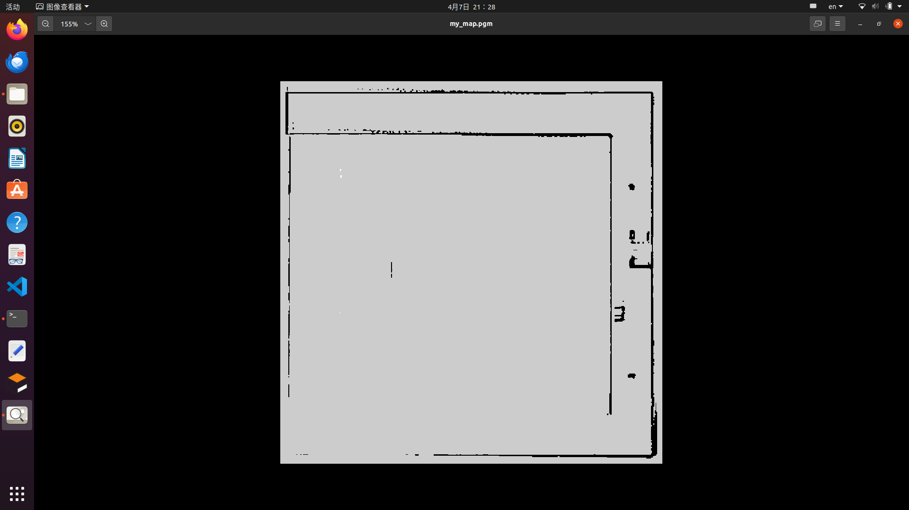
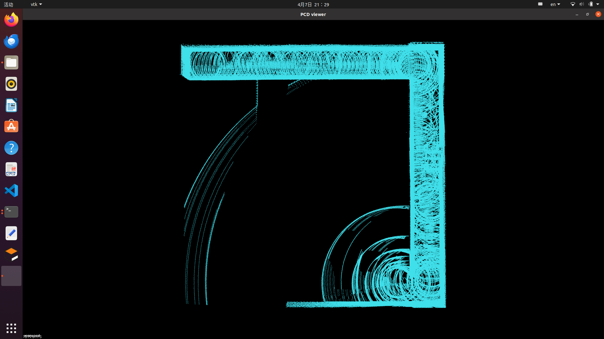

# ME5413_Final_Project_Group14

NUS ME5413 Autonomous Mobile Robotics Final Project
> Authors: [GUO ZECHEN](https://github.com/cruel5212), [DU Hangyu](https://github.com/duhangyu7702), [HU YUXUAN](https://github.com/nushyx)
> 


## Project Description


   This project involves designing and implementing an autonomous navigation and decision-making system for a mobile robot (the “Jackal”) within a structured yet dynamically changing environment. The environment contains obstacles, randomly placed boxes, a randomly generated bridge, and a timed blockade mechanism. The overall objective is to navigate the robot through a series of tasks while collecting and processing information about the surroundings.


## Installation

* System Requirements:
  * Ubuntu 20.04
  * ROS Noetic
  * C++11 and above
  * CMake: 3.0.2 and above
  * Gazebo

* Repository setup
   ```
  git clone https://github.com/Cruel5212/ME5413_Final_Project_Group14.git
  cp -r ~/ME5413_Final_Project/src/me5413_world/models/* ~/.gazebo/models
  cd ME5413_Final_Project
  rosdep install --from-paths src --ignore-src -r -y
  catkin_make
  source devel/setup.bash
  ```

## Usage

### 0. Gazebo World

This command will launch the gazebo with the project world

```bash
# Launch Gazebo World together with our robot
roslaunch me5413_world world.launch
```

### 1. Manual Control

If you wish to explore the gazebo world a bit, we provide you a way to manually control the robot around:

```bash
# Only launch the robot keyboard teleop control
roslaunch me5413_world manual.launch
```


### 2. Mapping

We provide three methods for SLAM mapping：

* A-LOAM (Recommened)
* Cartographer
* FAST-LIO

**Note**: Due to computational limitations, we recommend that you first record and prepare the relevant topic data, then use the SLAM algorithm to create your map. Since the data has been pre-recorded, you can use it directly.

#### 2.1 A-LOAM

   

   ```bash
   # Launch the A-LOAM algorithm
   roslaunch aloam_velodyne aloam_velodyne_VLP_16.launch

   # Replay the data bag
   cd ~/ME5413_Final_Project/src/me5413_world/mapping_rosbag
   rosbag play all_topics.bag --clock
   ```

   If you want to evaluate the algorithm's performance using the evo tool, you need to run the code below to record the data.
   
   ```bash
   # Record the mapping results
   rosbag record -a -O ALOAM_result

   # Save the PCD point cloud file
   rosrun pcl_ros pointcloud_to_pcd input:=/laser_cloud_map _prefix:="~/ME5413_Final_Project/src/me5413_world/maps/ALOAM_PCD/aloam_map"
   ```

   Since we later use the ACML algorithm for localization, it is necessary to convert them into the required pgm and yaml map files.
   
   ```bash
   # Convert the map file format
   roslaunch pcd2pgm run.launch
   rosrun map_server map_saver -f ~/ME5413_Final_Project/src/me5413_world/maps/Cartographer_map/my_map map:=/map
   ```
   We used the evo tool to evaluate performance.
   
   ```bash
   # Evaluate performance using the evo tool
   evo_ape bag ALOAM_result.bag /gazebo/ground_truth/state /aft_mapped_to_init_high_frec    --plot --align
   ```

#### 2.2 Cartographer

    

   Since Cartographer is not available in final project workspace, you need to open the Cartographer workspace and run the following command.
   
   ```bash
   # Launch the Cartographer algorithm
   source install_isolated/setup.bash
   roslaunch cartographer_ros my_robot3d.launch bag_filename:=~/ME5413_Final_Project/src/me5413_world/mapping_rosbag/all_topics.bag
   cd ~/ME5413_Final_Project/src/me5413_world/maps/mapping_rosbag

   # Record the mapping results
   rosbag record -a -O Cartographer_result

   # Save the map
   rosrun map_server map_saver --occ 66 --free 34 -f ~/ME5413_Final_Project/src/me5413_world/maps/Cartographer_map/my_map map:=/map

   # Evaluate performance using the evo tool
   evo_ape bag Cartographer_result.bag /gazebo/ground_truth/state /tf:map.base_link --plot --align
   ```

#### 2.3 Fast-LIO

    
   
   ```bash
   # Launch the FAST-LIO algorithm
   roslaunch fast_lio mapping_velodyne.launch

   # Replay the data bag
   cd ~/ME5413_Final_Project/src/me5413_world/maps/mapping_rosbag
   rosbag play all_topics.bag --clock

   # Record the mapping results
   rosbag record -a -O FASTLIO_result

   # Save the PCD point cloud file
   rosrun pcl_ros pointcloud_to_pcd input:=/cloud_registered _prefix:="~/ME5413_Final_Project/src/me5413_world/maps/FASTLIO_PCD/fastlio_map"

   # Evaluate performance using the evo tool
   evo_ape bag FASTLIO_result.bag /gazebo/ground_truth/state /Odometry --plot --align
   ```

   

### 3. Navigation

Once completed **Step 2** mapping and saved your map, quit the mapping process.


  
```bash
# Load a map and launch AMCL localizer
roslaunch me5413_world navigation.launch
# start navigation in the second terminal:
python g.py
```

* We have provided you a GUI in RVIZ that allows you to click and generate/clear the random objects in the gazebo world:
  
  


## Contribution

You are welcome contributing to this repo by opening a pull-request

We are following:

* [Google C++ Style Guide](https://google.github.io/styleguide/cppguide.html),
* [C++ Core Guidelines](https://isocpp.github.io/CppCoreGuidelines/CppCoreGuidelines#main),
* [ROS C++ Style Guide](http://wiki.ros.org/CppStyleGuide)

## License

The [ME5413_Final_Project](https://github.com/NUS-Advanced-Robotics-Centre/ME5413_Final_Project) is released under the [MIT License](https://github.com/NUS-Advanced-Robotics-Centre/ME5413_Final_Project/blob/main/LICENSE)
